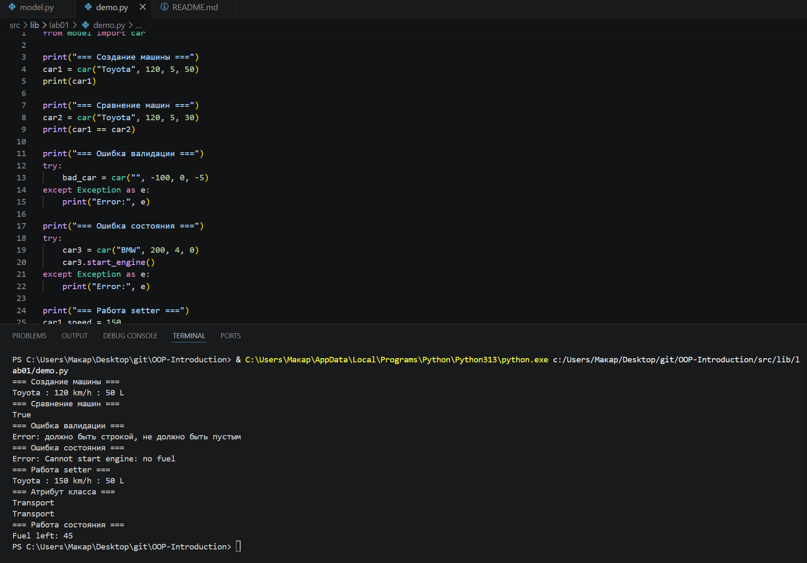

<h1>Лаборатоная работа 1</h1>


<h3>Задание на 4</h3>

<h2>model.py</h2>

```python
class car():
    category = "Transport"

    def __init__(self, brand: str, speed: int, capacity: int, fuel: int):
        self._brand = self._validate_brand(brand)
        self._speed = self._validate_speed(speed)
        self._capacity = self._validate_capacity(capacity)
        self._fuel = self._validate_fuel(fuel)
        self._engine_on =False
    


    def _validate_brand(self,brand):
        if not isinstance(brand, str) or brand.strip() == '':
            raise ValueError("должно быть строкой, не должно быть пустым")
        return brand 
    
    def _validate_speed(self,speed):
        if not isinstance(speed, int) or speed<0:
            raise ValueError('скорость не может быть меньше 0')       
        return speed 
    
    def _validate_capacity(self, capacity):
        if not isinstance(capacity, int) or capacity<0:
            raise ValueError('вместимость > 0')
        return capacity
    
    def _validate_fuel(self, fuel):
        if not isinstance(fuel, int) or fuel <0:
            raise ValueError('топливо>0')
        return fuel
    
    @property
    def brand(self):
        return self._brand
    
    @property
    def speed(self):
        return self._speed
    
    @speed.setter
    def speed(self, value):
        self._speed = self._validate_speed(value)

    @property
    def capacity(self):
        return self._capacity
    
    @property
    def fuel(self):
        return self._fuel
    
    def __str__(self):
        return f"{self.brand} : {self.speed} km/h : {self.fuel} L"
    
    def __repr__(self):
        return f"Car(brand='{self._brand}', speed={self._speed}, capacity={self._capacity}, fuel={self._fuel})"
    
    def __eq__(self, other):
        if not isinstance(other, car):
            return False
        return self._brand == other._brand and self._speed == other._speed
    
    

    def start_engine(self):
        if self._fuel <= 0:
            raise RuntimeError("не может быть запущен, нет топлива")
        self._engine_on = True

    def stop_engine(self):
        self._engine_on = False

    def drive(self, distance):
        if not self._engine_on:
            raise RuntimeError("двигатель включен")

        fuel_needed = distance // 10

        if fuel_needed > self._fuel:
            raise RuntimeError("недостаточно топлива")

        self._fuel -= fuel_needed
```


<h2>demo.py</h2>


```python
from model import car

print("=== Создание машины ===")
car1 = car("Toyota", 120, 5, 50)
print(car1)

print("=== Сравнение машин ===")
car2 = car("Toyota", 120, 5, 30)
print(car1 == car2)

print("=== Ошибка валидации ===")
try:
    bad_car = car("", -100, 0, -5)
except Exception as e:
    print("Error:", e)

print("=== Ошибка состояния ===")
try:
    car3 = car("BMW", 200, 4, 0)
    car3.start_engine()
except Exception as e:
    print("Error:", e)

print("=== Работа setter ===")
car1.speed = 150
print(car1)

print("=== Атрибут класса ===")
print(car.category)
print(car1.category)

print("=== Работа состояния ===")
car1.start_engine()
car1.drive(50)
print("Fuel left:", car1.fuel)

```



В первую очередь определить какие будут атрибуты. Для машины сразу приходят на ум марка, скорость количесвто топлива, вместимость.
Создаем класс задав атрибуты и делая закрытые поля. Добавляем атрибут класса

Далее создаем конструктор для проверки данных. Проверяем каджый атрибут на соответствие типа данных и логическую корректность, то есть марка не пуста, скорость, вместимость и кол-во топлива не отрицательные. В ином случае выбрасываем ошибку 

Свойства (@property) для чтения. setter с валидацией(написанную ранее) для скорости для изменения данных.

Методы __str__ __repr__ __eq__. str для красивого вывода данных(через f-строку), eq для сравнения обьектов по марке и скорости, repr для полной информации об обьекте.

Простые бизнес-методы для запуска двигателя(при условии что топливо больше 0) выключение двигателя и езды(на определеное расстояние, с проверкой на то хватит ли топлива и расходом 10км/1л)


